# PTCGextension

Developers: [Eduardo Mendes Vaz](https://github.com/EduardoMVAz), [Gustavo Lindenberg Pacheco](https://github.com/gustavolp1), [Pedro Ântonio Silva](https://github.com/P-ASilva), [Pedro Vaz de Moraes Pertusi](https://github.com/PedroPertusi)

## Summary

This project's main objective is to create an app that can detect Pokémon cards in pictures or videos of professional Pokémon Trading Card Game matches, and show the complete card to the user, allowing anyone who doesn't know all the cards to read a digitalized version of the card, and understand what it does.

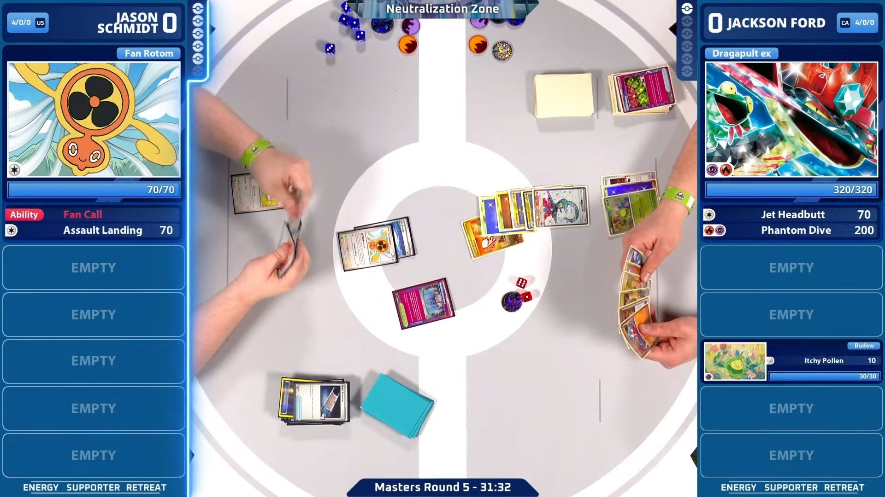

This README describes all attempts and results from the development of this project, in the following structure:

- [Data](#data)
- [Model Training](#model-training)
- [Results](#results)
- [Future Work](#future-work)

## Data

The data used for this project was a collection of high definition pokémon cards sourced from a web-available [Pokémon card API](https://docs.pokemontcg.io/).

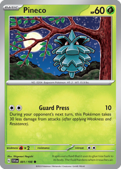

At first, we decided to use all of the collections currently playing (as of April/2025). In other words, all collections a player can use in a regular Pokémon TCG tournament. This set consists of 3040 cards, being part of the following collections (To see more about collection details, go to the [Pokémon card API docs](https://docs.pokemontcg.io/)):

    - SV1
    - SV2
    - SV3
    - SV3pt5
    - SV4
    - SV4pt5
    - SV5
    - SV6
    - SV6pt5
    - SV7
    - SV8
    - SV8pt5
    - SV9
    - SVP

These cards can be obtained using the ```dataset.ipynb``` script inside the ```data_scripts/``` directory, which will create a ```cards/``` directory, with a directory for each card inside, containing the card's image:
```
cards/
└── sv1-1/
    └── sv1-1.png
```

More information about the **training data** can be found in the following **Model Training** section, linked to each specific attempt.

## Model Training

This project tested training multiple models using different approaches and data. This section will detail all attempts at training models, their goals, and results. All models were trained using YOLOv8 and the **ultralytics** library.

### Separate Object Detection and Classification Model

The first attempt made to achieve the desired result of classifying Pokémon cards on a frame was to use an object detection model that would detect the pokémon cards and then send the cropped sections to an image classifier, which would classify it as one of the classes.

The object detection was very simple to train and to obtain good results. We captured and used for training about 50 images of matches, obtaining a very good accuracy:

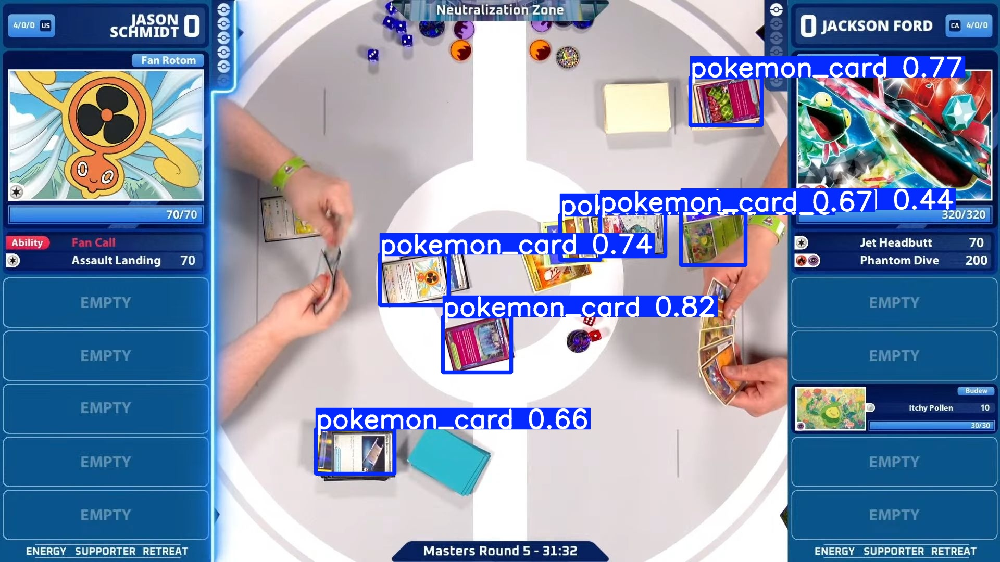

However, the classification model wasn't so simple. Due to the data avaiability limitation (it would be impossible to obtain images of all 3040 cards in play, not just because it would be very time consuming, but also because most cards are not competitive), we decided to train our model **with the cards obtained via API**, applying different data augmentation.

To make that possible, for each card, we created 20-30 augmented versions, utilizing one of the following per version:

- Brigthness (darker and brighter versions)

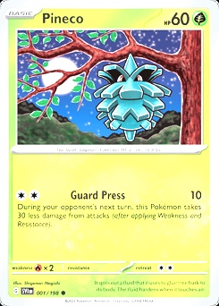
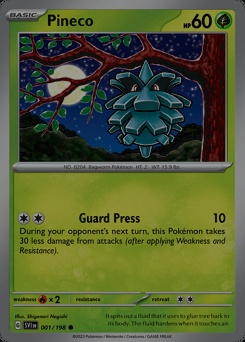

- Lower Resolution


- Noise

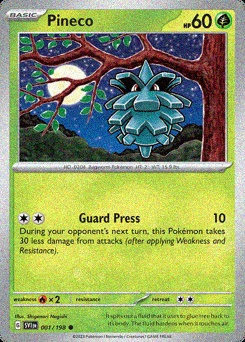

- Rotation (all variations of 45 degrees)

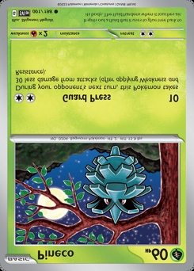

After testing the models with more images captured from matches, we concluded our model combination was not successful, obtaining an average accuracy of 40% across all pictures used. However, this number made us optimistic to try the other promising approach we had thought of: a single Object Detection and Classification model, trained using **a synthetic dataset**. 

### Object Detection and Classification Model\

The 40% accuracy on our baseline model with 3040 classes drove us optimistic about developing this model, given it would have way more data.

Given that we had all cards, knew their classes, and had table images, we aimed to create a synthetic dataset of table images and labels, and then train an Object Detection and Classification model using this synthetic dataset.

This sub-section will list all attempts and how they evolved from previous ones.

#### First Version - All Classes

The first version of the model had it's synthetic dataset created using 10 versions of each card, the base card and 9 augmented versions (brightness, noise, resolution, but no rotation, given the cards are always rotated in the table) pasted on one empty table image.

If you have used the ```data_scripts/dataset.ipynb``` notebook to create the directory with all cards, you can use the ```data_scripts/augmentation.py``` script to create these augmented versions on your local workspace.

Having these augmented cards, you can create a synthetic dataset using the ```data_scripts/synthetic_dataset.ipynb``` notebook. Read the code to understand how to insert more collections and how to alter the amount of times a card appears in the synthetic dataset.

The empty table looks like:

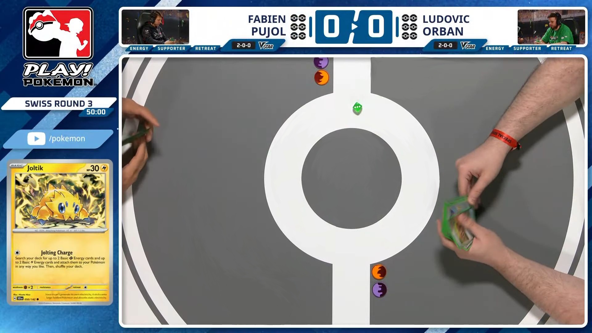

And one synthetic image looks like:

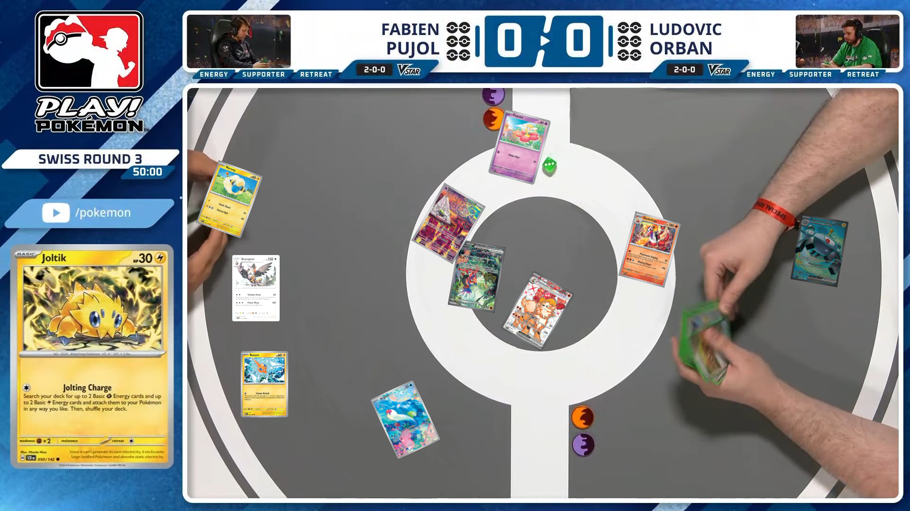

The labels created were in the following format:

    246 0.523958 0.540278 0.063542 0.143519
    68 0.290625 0.751852 0.052083 0.129630
    223 0.590625 0.608796 0.081250 0.158333
    65 0.252344 0.390278 0.073438 0.152778
    37 0.714063 0.488426 0.068750 0.149074
    90 0.570833 0.287500 0.068750 0.149074
    149 0.281250 0.563889 0.052083 0.129630
    209 0.492708 0.437500 0.081250 0.158333
    225 0.900521 0.490278 0.063542 0.143519
    205 0.445573 0.820833 0.077604 0.156481

We tried 3 versions of this model, with the following setups:
| Model  | # of Classes | Versions per Card | Positions                      | Cards per Image | Notes                                                                       |
| ------ | ------ | ------ | ------ | ------ | ------ |
| YOLOv5 | 3040         | 10                | Real (collected from gameplay) | 3 to 15         | 30h training, failed multiple times | 
| YOLOv8 | 3040         | 10                | Real (collected from gameplay) | 3 to 15         | Same setup as YOLOv5 but using the YOLOv8 architecture (easier to use, more stable) |
| YOLOv8 | 3040         | 10                | Random (not restricted to play area) | 3 to 15         | Positions of cards are completely random |

Observation:

The difference between the two position types was that, for the first version, we decided to use **positions found by the object detection model on real match images** to try to mimic how a real playing field would work. For the second version, we randomized the positions, to see if that had any impact in the model's performance.

#### First Version - Results

The first version yielded disappointing results - not only the models took very long to train, but also none of them had an even remotely good accuracy. Furthermore, lack of more potent hardware was also a problem. Often times during training our computers failed and we had to restart from where the training stopped. All of the models had a very low confidence level in their predictions, and the predicted classes were frequently wrong.

An intuitive next step would be to create even more data for training. However, with our setups, it was impossible to train these models with even more data, due to the computational power limitations. This led to the second version of the model: **Training with only one collection**

#### Second Version - Only the SV base set (SV1)

The Second Version of our model aimed to reduce our scope: train using only one collection, and observe the results with less classes. We decided to train the model using the base set of Scarlet and Violet, the current playing set of collections, and observe how the model would behave.

We also made several changes between this version's attempts, due to it's shorter training time (20h approx.) trying to improve the model.

| Model  | # of Classes | Versions per Card | Card Usage per Image | Positions                            | Cards per Image | Different Backgrounds |
| ------ | ------------ | ----------------- | -------------------- | ------------------------------------ | --------------- | ------------- |
| YOLOv8 | 258          | 10                | 1x                   | Random (not restricted to play area) | 3 to 15         | Just the normal table background |
| YOLOv8 | 258          | 10                | Each version used 3x | Random (restricted to play area) | 3 to 15         | Just the normal table background |
| YOLOv8 | 258          | 10                | Each version used 3x | Random (restricted to play area) | 3 to 15         | Images use 1 of 6 different table backgrounds with varying stream UI layouts |
| YOLOv8 | 258          | 10                | Each version used 3x | Random (restricted to play area) | 3 to 15         | Images use a completely white background |

The first attempt followed the same exact approach as the last failed attempt with all classes, but uses only the first collection. This model yielded more confidence, but the predictions still were not accurate. As seen on the following image, the confidence level was low, and the cards predicted are almost all wrong.

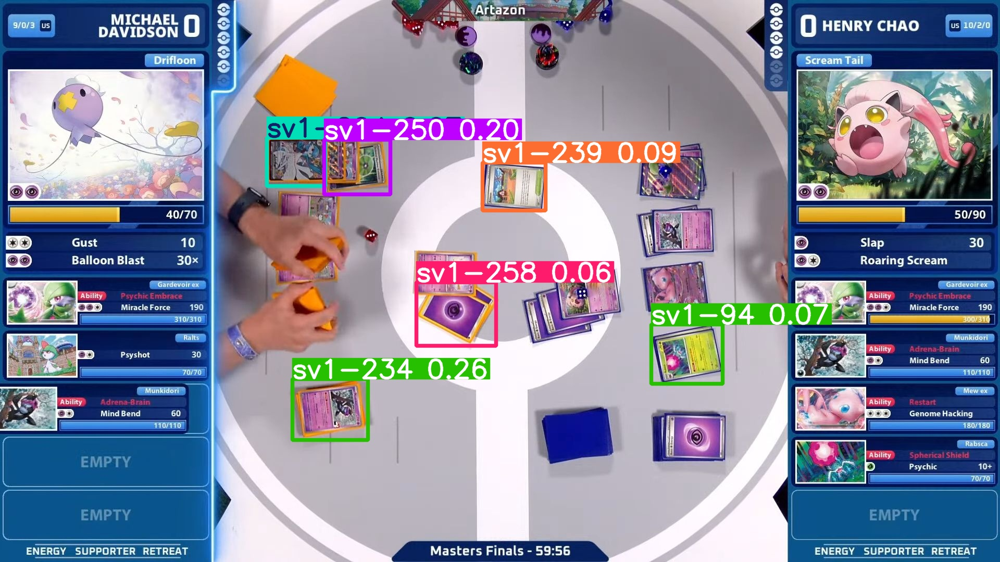

The second attempt significantly improved the confidence level of the model, due to the increase in data: we placed each version of the cards 3 times in the construction of the synthetic dataset, which means 30 times each card on the collection. We also restricted the cards to be pasted only on the playing area, instead of all around the image. Still, the predictions aren't correct.

This image has a bunch of noise (the minimum confidence level for the prediction was very low), but it is possible to see that the model has a high confidence level on at least some cards (even though they are wrong):

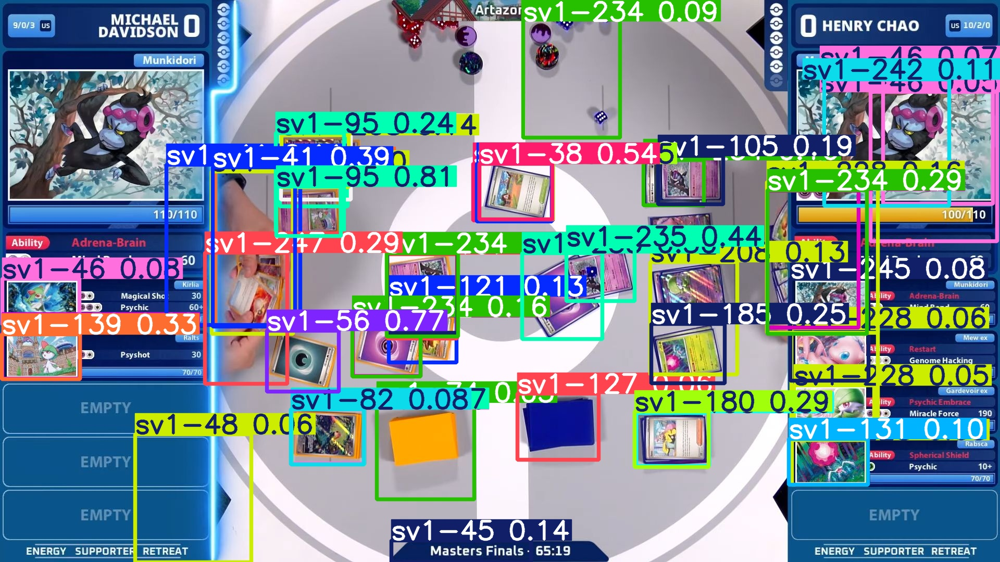

The third attempt was made to see if the background was influencing the predictions of the model. We obtained more images of clear tables, to use as a variant background for the model. Not much changed from the second attempt, however.

Finally, the fourth and final attempt was made to see if this problem was viable at all: we utilized a completely white background. Due to the different background, we also had to use the synthetic images to test the model's accuracy. It was no surprise that this model had a very high accuracy now that the testing images are similar to the training ones, but it does not work on a real life setting.

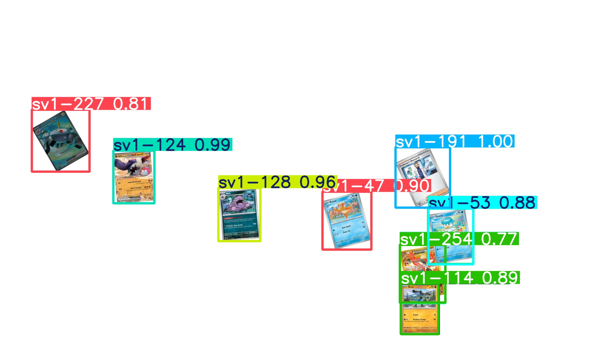

### Future Work

Unfortunately, all of our attempts failed at solving the problem consistently. For that reason, we decided to list what would be our next steps in continuing this problem, to try improving the models we trained:

- More Computational Power: Having a more powerful hardware to train the models would allow heavier training sessions (bigger batch sizes), more epochs and more data to be used for each training.
- Better Data: Creating an even more realistic synthetic dataset, mirroring the appearence of cards in real life, could improve the performance of the model in real table images, given that, even with data augmentation, our synthetic images clearly aren't as realistic. Another option is to use real data to train the model, which would pose a tough challenge of having to manually label frames of games (added to the problem that most cards are not competitive).


## YOLO Card Detector

A desktop application that detects and displays Pokémon TCG cards in videos and images using a custom-trained YOLOv8 model.

### Features

- Detect cards in videos and export detection results
- Detect cards in static images
- The user can click on a detected card to zoom into its detail
- View previously processed videos and navigate frame-by-frame
- Automatically hides UI overlay to avoid interfering with screen captures

---

### How It Works

This app uses a YOLOv8 model (`my_model/best.pt`) to detect Pokémon cards in video frames or static images. Detected bounding boxes are drawn on-screen, and you can click on them to view the corresponding card from the `/cards` directory.

---

### Requirements

Install dependencies via:

```bash
pip install -r requirements.txt
```

Minimal requirements:
- Python 3.8+
- PyQt5
- OpenCV
- ultralytics (for YOLOv8)
- mss
- pygetwindow

---

### How to Run

```bash
python main.py
```

---

### How to Use

1. **Process Video**
   - Click `Process Video`
   - Select a `.mp4`, `.avi`, or `.mov` file
   - Wait for processing to finish (progress bar visible)
   - Bounding boxes are saved and drawn on each frame

2. **Play Processed Video**
   - Click `Play Processed Video`
   - Choose from the list of previously processed videos
   - Use the slider to navigate
   - Click on cards to see details in the right panel

3. **Detect on Image**
   - Click `Detect on Image`
   - Choose a static image (`.jpg`, `.png`, etc.)
   - Click on a card to view the zoomed image

---

### Card Image Structure

Each detected card index `N` should have an image in:

```
./cards/sv1-N/sv1-N.png
```

This is shown when the user clicks on a detected card.

---

### Notes

- Detection results are saved in `results/results_N.txt`
- Output videos with bounding boxes are saved in `results/output_N.mp4`
- YOLOv8 model should be placed in `my_model/best.pt`
- If no matching card image is found, a fallback message is shown

---

### Example Use Case

You record a match using screen recording, run the app, and use "Process Video" to detect all cards seen. Then, you can review detections and zoom into individual cards by clicking on them — helpful for match reviews, stream overlays, or analysis

### Similar References 

https://dev.twitch.tv/docs/extensions/

https://dashboard.twitch.tv/extensions/apwln3g3ia45kk690tzabfp525h9e1

https://github.com/HearthSim/Hearthstone-Deck-Tracker
